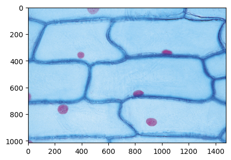
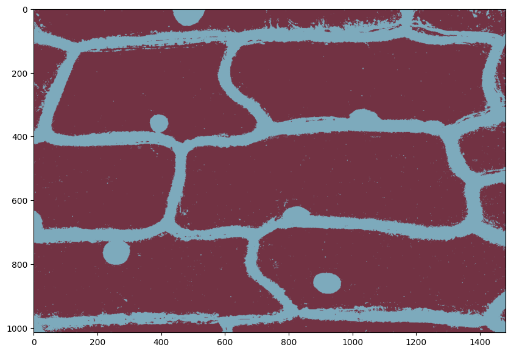
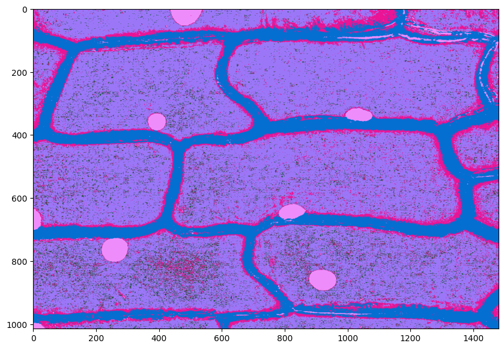
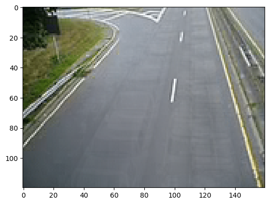
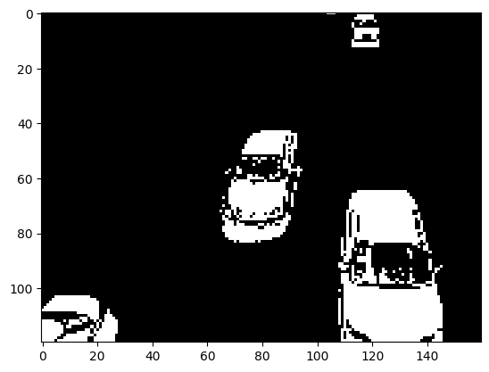

# Gaussian-Mixture-Models-for-Background-Extraction

This repository contains a Jupyter Notebook that implements Gaussian Mixture Model (GMM) for semantic segmentation and background extraction. GMM class is implemented from scratch without using any libraries like sklearn.

If you are unable to render the notebook on github, you can view it [here](https://nbviewer.org/github/akash18tripathi/Gaussian-Naive-Bayes-From-Scratch/blob/main/Gaussian%20Naive%20Bayes.ipynb)

## What Jupyter Notebook has to offer?

This Jupyter Notebook provides an in-depth exploration of Gaussian Mixture Models for tasks like Semantic segmentation and Background Subtraction. It covers various topics and implementations related to SVM. The notebook includes the following sections:

## 1) Implementation Base GMM class

This section focuses on implementing the Gaussian Mixture Model class from scratch using Expectation-Maximization(EM) approach. 

## 2) Semantic segmentation

In the context of semantic segmentation, GMM can be used to model the distribution of pixel intensities for different classes or regions. By assigning pixels to the component with the highest responsibility, we can segment the image into meaningful regions.

The Jupyter Notebook in this repository provides an implementation of GMM-based semantic segmentation. It demonstrates how to train the GMM model using pixel intensities and use it for segmenting images into different classes or regions.

*Description: Original Image taken*

*Description: Image with 2 GMM components *

*Description: Image with 5 GMM components *

## 3) Background Subtraction

The Jupyter Notebook in this repository also includes an example of background subtraction using GMM. It shows how to train a GMM model on a video sequence to estimate the background, and then subtract the background from each frame of a GIF file to extract the foreground objects.

*Description: Original GIF*

*Description: Extracted background*

*Description: Subtracted Background Results! *

## Concepts

## GMM Overview

GMM is a probabilistic model that represents the distribution of data points as a mixture of Gaussian distributions. It is a flexible model that can approximate complex data distributions by combining multiple Gaussian components.

## EM Algorithm

The EM algorithm is commonly used to estimate the parameters of a GMM. It consists of two iterative steps: Expectation (E-step) and Maximization (M-step).
### E-step
In the E-step, the algorithm computes the responsibilities of each data point to each Gaussian component based on the current parameter estimates. The responsibility (also known as the posterior probability or the soft assignment) represents the likelihood that a data point belongs to a specific Gaussian component.

The responsibility of the `i-th` data point `x_i` to the `k-th` Gaussian component is given by:

r_{ik} = w_k * N(x_i|μ_k, Σ_k) / Σ_j (w_j * N(x_i|μ_j, Σ_j))

where:
- `r_{ik}` is the responsibility of the `i-th` data point to the `k-th` Gaussian component
- `w_k` is the weight or the mixing coefficient of the `k-th` Gaussian component
- `N(x_i|μ_k, Σ_k)` is the Gaussian distribution with mean `μ_k` and covariance matrix `Σ_k`
- The denominator normalizes the responsibilities to ensure that they sum up to 1 for each data point

### M-step

In the M-step, the algorithm updates the parameters of the Gaussians based on the weighted data points. It maximizes the log-likelihood of the observed data by adjusting the means, covariances, and mixing coefficients.

The updated parameters for the `k-th` Gaussian component are given by:

μ_k = (Σ_i (r_{ik} * x_i)) / (Σ_i r_{ik})

Σ_k = (Σ_i (r_{ik} * (x_i - μ_k) * (x_i - μ_k)^T)) / (Σ_i r_{ik})

w_k = (Σ_i r_{ik}) / n

where:
- `μ_k` is the updated mean of the `k-th` Gaussian component
- `Σ_k` is the updated covariance matrix of the `k-th` Gaussian component
- `w_k` is the updated weight or mixing coefficient of the `k-th` Gaussian component
- `n` is the total number of data points

The EM algorithm iterates between the E-step and M-step until convergence, where the log-likelihood of the observed data stops improving significantly.

## GMM for Semantic Segmentation

In the context of semantic segmentation, GMM can be used to model the distribution of pixel intensities for different classes or regions. By assigning pixels to the component with the highest responsibility, we can segment the image into meaningful regions.

# Background Subtraction Methods

This section explains three common methods for background subtraction: frame averaging, Gaussian Mixture Model (GMM), and K-means clustering.

## 1. Frame Averaging

Frame averaging is a simple and intuitive method for background subtraction. It involves computing the average pixel values across a sequence of frames to estimate the background.

1. Initialize an empty accumulator array to store the cumulative sum of pixel values.
2. Iterate over the frames in the sequence.
3. For each pixel position, add the corresponding pixel value to the accumulator array.
4. Divide each element in the accumulator array by the total number of frames to obtain the average.
5. Threshold the input frames by subtracting the average background from each frame.

Frame averaging works well when the background is relatively static and the foreground objects exhibit motion or changes in appearance.

## 2. Gaussian Mixture Model (GMM)

Gaussian Mixture Model (GMM) is a probabilistic model that represents the distribution of pixel intensities as a mixture of Gaussian distributions. GMM-based background subtraction is a popular method for handling dynamic backgrounds.GMM per pixel is commonly used for background subtraction in video processing. Instead of modeling the entire image as a mixture of Gaussian distributions, each pixel in the image is modeled independently based on its intensity values over time.

1. Initialize a GMM for each pixel in the image.
2. For each incoming frame, update the GMM parameters per pixel.
3. Calculate the likelihood of each pixel belonging to the background based on the corresponding GMM. To extract the Mean background image, we can assign values of the Means corresponding to the highest weighted Gaussian for each pixel.
4. Threshold the likelihood values to obtain the foreground mask.

By modeling each pixel independently, GMM per pixel can handle dynamic backgrounds and adapt to changes in lighting conditions, shadows, and foreground object appearance.

## 3. K-means Clustering

K-means clustering is a technique for partitioning data into K clusters based on their similarity. It can be applied to separate the foreground and background in an image or video sequence.

1. Initialize K cluster centers randomly or using a predefined strategy.
2. Assign each pixel to the nearest cluster center based on the Euclidean distance.
3. Update the cluster centers by computing the mean of the pixels assigned to each cluster.
4. Repeat steps 2 and 3 until convergence or a predefined number of iterations.
5. Threshold the input frames by labeling the pixels assigned to the background cluster as background and the rest as foreground.

K-means clustering is computationally efficient and works well when the foreground and background have distinct color or intensity characteristics.

---

These three methods provide different approaches to background subtraction. The choice of method depends on the characteristics of the background and foreground objects in the specific application.

## Contributing

Contributions are welcome and encouraged!
